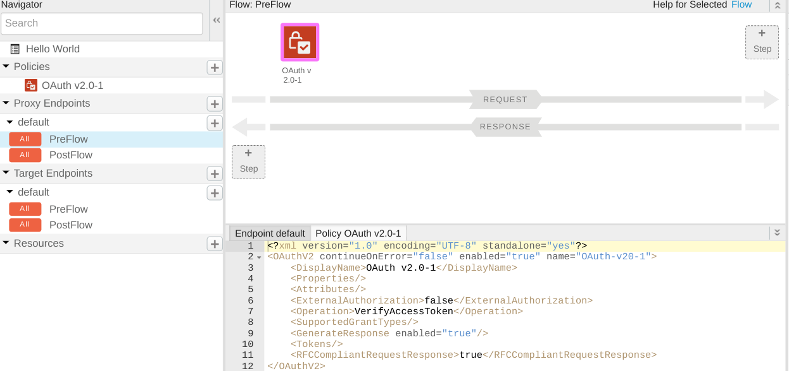
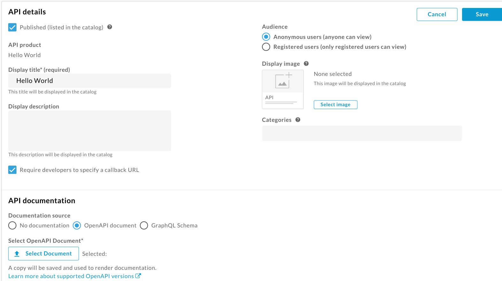
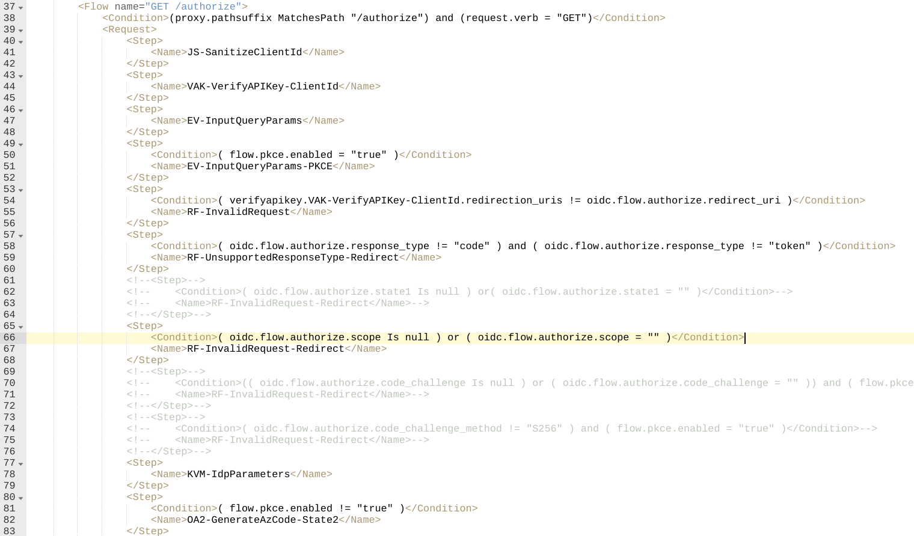
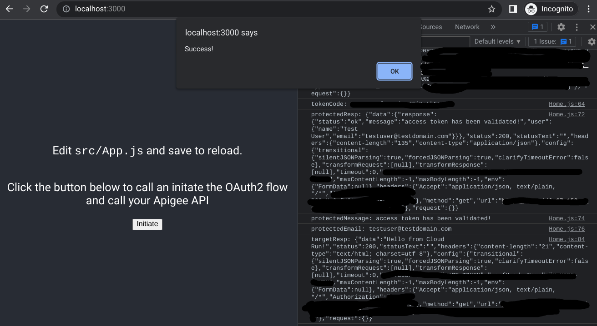

# 3-legged-oauth-okta
Implement 3-legged OAuth on Apigee using Okta as an IDP

## Intro

Welcome to this lab on using Okta to implement a 3-legged OAuth flow in Apigee

We will piggyback off the devrel [idp-okta-integration](https://github.com/apigee/devrel/tree/main/labs/idp-okta-integration) lab, and extend it. The devrel lab gets the OAuth flow working via curl commands and copy/paste. This lab is meant to take it a step further and get it working in the developer portal and in a client application. By the end of this lab you should be able to understand 3-legged OAuth and how to apply it in production environments.

Lets get started!

## Prereqs

Complete the [devrel okta lab](https://github.com/apigee/devrel/tree/main/labs/idp-okta-integration). We'll be picking up where this leaves off.

## But first...

In the devrel lab section "Use Identity Facade with API Proxy" you were able to send your OAuth token to the default Apigee hello-world proxy. However, the lab seems to have forgotten to tell you to add an OAuthV2 policy to verify the token. Let's do that now.

1. In the Apigee portal, go to Develop > API Proxies > hello-world > Develop
2. Under Proxy Endpoints click PreFlow. Then, click the "+ Step" button in the preflow.
3. Add the policy called "OAuth v2.0-1". No changes are needed to it.

4. Save and deploy the new version of the hello-world proxy
5. Go back through the devrel steps [here](https://github.com/apigee/devrel/tree/main/labs/idp-okta-integration#use-identity-facade-with-api-proxy) to test the proxy auth. You should be able to start at step 8 if you'd gone through the lab before.

    - NOTE: If your /token call is failing (it'll fail silently so log the token to verify) the the reason may be that your BASE64_ENCODED string is improperly formed. To fix, try using a [different means](https://www.base64encode.org/) of encoding it in url-safe base 64 and run through the steps again.

## Developer Portal

### Create the developer portal app

We need to create a new app for the developer portal as the app callback URL will change

1. Navigate to Publish > Apps
2. Click on +App and configure it as follows:

    - Name: Hello World Portal App
    - Developer: Jane Doe (this user was also created during the identity facade deployment)
    - Product:
    - Hello World
    - Identity Facade
3. Scroll up and click save

### Create the developer portal

1. Go to Publish > Portals
2. Create a new portal. You could name it "Hello World Portal" if you'd like.
3. Next, let's add an API to it. Go to APIs > + to add a new API. Select the Hello World product you created in the devrel lab
4. Update the Hello World product to be Published (listed in the catalog), and Require developers to specifify a callback URL.
5. Next in the Hello World product upload API documentation in the form of an OpenAPI document. Use the yaml from this repository > apigee/helloWorldApiSpec.yaml. You'll have to replace every mention of "{environment_group_hostname}" with you Apigee Group hostname (Admin > Environments > Groups)

6. Update the Hello World Portal App to use a callback URL. Define it as https://{developer_portal_host}/oauth_redirect. You can get developer_portal_host by going to the hello-world product and clicking "Live Portal"

### Update the oauth proxy

The Okta OAuth identity facade proxies as given by Drevel don't work with the developer portal out of the box. My recommendation is to go to download the apigee/hello-world folder, zip it up, and import it as a new version of the hello-world proxy. If you want to do the changes yourself, or just want to see a summary of the changes, follow the steps below:]

1. Navigate to the identity facade proxy. Go the the develop tab.
2. In the /authorize flow, we'll want to remove a couple of unneeded conditional steps. There are 3 steps to delete and they are all named RF-InvalidRequest-Redirect and can be seen in the image below

3. We'll also need to add a CORS policy for preflight requests. Add the OptionsPreFlight Flow from Apigee Documentation [here](https://docs.apigee.com/api-platform/develop/adding-cors-support-api-proxy#handlingcorspreflightrequests). This will also require you to create a new AssignMessage policy called "add-cors". You can replace the policy definition with what's in /apigee/identity-facade-v1/policies/add-cors.xml.
4. You'll also want to add a CORS policy on the proxy endpoint response PostFlow. Reuse the Add CORS policy from step 3. See Apigee Documentation [here](https://docs.apigee.com/api-platform/develop/adding-cors-support-api-proxy#attachinganaddcorspolicytoanewapiproxy)
5. Repeat steps 3 and 4 (see note for 4) with you hello-world proxy. Note: Put the code from step 4 in the target endpoint response postflow, not the proxy endpoint. This is how it's shown in the documentation.
6. We don't want CORS Options requests to be forced through out OAuth check or hit the backend. Migrate the OAuth-20-1 step from preflow to flows and make it conditional so it only runs if the request verb is not OPTIONS (`<Condition>request.verb != "OPTIONS"</Condition>`). Also, add route for OPTIONS requests `<RouteRule name="NoRoute"><Condition>request.verb == "OPTIONS"</Condition></RouteRule>` (see apigee > hello-world > proxies > default.xml)
7. If we want useful error messages to be returned to the user, we need to implement CORS on faults as well. Add a DefaultFaultRule that references your add-cors policy, follow [this](https://www.googlecloudcommunity.com/gc/Apigee/CORS-on-error/td-p/14127) community post to implement.
8. The portal sends the Auth token header in the format of "BearerToken xxx" instead of the normal "Bearer xxx", but the OAuth verification policy expects "Bearer xxx". To fix this, implement the custom JavaScript policy found at apigee/hello-world/policies/
9. Verify your code changes against the code in this repo apigee > hello-world > proxies/policies/authHeaderTransform.xml
10. Be sure to save and deploy all changes

### Test the portal

1. Navigate to your Live Developer Portal (Publish > Portals > Hello World > Live Portal)
2. Create an account
3. Sign in
4. Navigate to your hello-world api
5. Click the authorize button. For clientId and clientSecret use the values provided in the drevel lab via Okta
6. Test the hello-world API

## Client Application

### Update Apigee

The applicaition that we created for the developer portal uses a developer portal callback url. We need to create a new application with an updated callback url that matches our localhost client URL

1. Go to Publish > Apps > Create New App
2. Name it hello-world, give it a callback URL of http://localhost:3000/oauth_redirect, add credentials and select both Identity Facade and your Hello World products when you do so. Finally, create create.
3. In the next page, copy the new created client id and secret from credentials. You will use these in future steps.

### Local Client App Setup

1. On your local machine, download the code within the /client folder of this repository. This is a simple Node.js React client application.
2. In Home.js assign the domain variable the value of your Apigee domain
3. In client/src create a new folder called app_secrets. Within it create a file called <code>clientVars.json</code>
4. In <code>clientVars.json</code> create 3 json properties, clientId, clientSecret, and redirectUrl. Use the credentials and redirect_url from your newly created Apigee app.

### Test Flow

1. In command line, navigate the the folder's directory
2. Run the command <code>npm i</code> to install dependencies
3. Run the command <code>npm start</code> to start the local server
4. Navigate to http://localhost:3000 to access the application
5. Open up the browser console by pressing CTRL+i. Be sure to navigate to the console
6. Click the Initiate button, go through the OAuth flow, and keep your eye on the logs in the browser console
7. If everything went well, you should see an alert that says "Success!"

## What's Next?

Lots of features could be implemented to improve this flow. For starters we should store the token somewhere once we have it so we don't have to grab a new one every time. Apigee caching features could also be used to improve latency and potentially store tokens as well. Also, we never deployed this application to the live internet. I'd recommend storing the app_secrets variables in a secure storage service like Google's Secrets Manager. The client application could be deployed on something like App Engine or Cloud Run with ease.